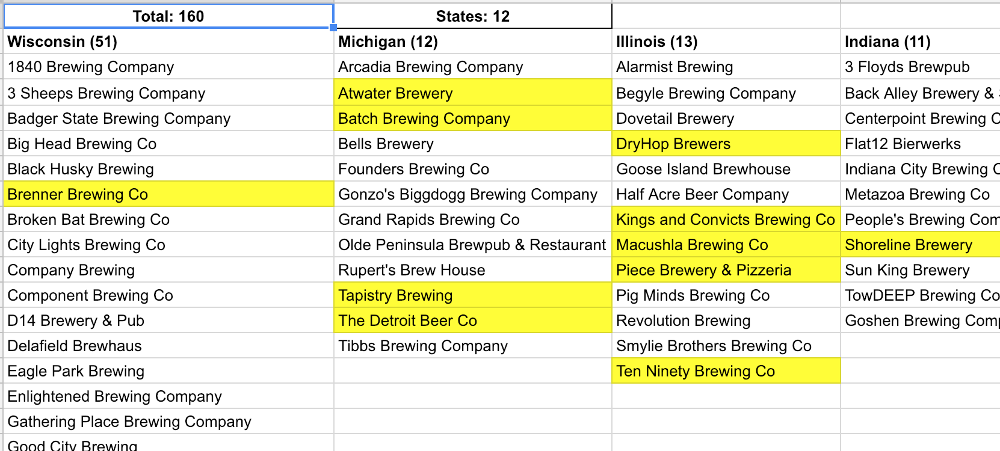
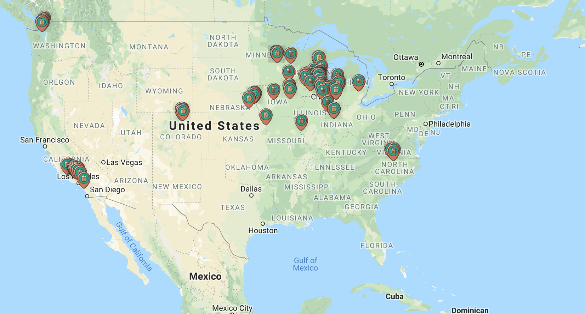
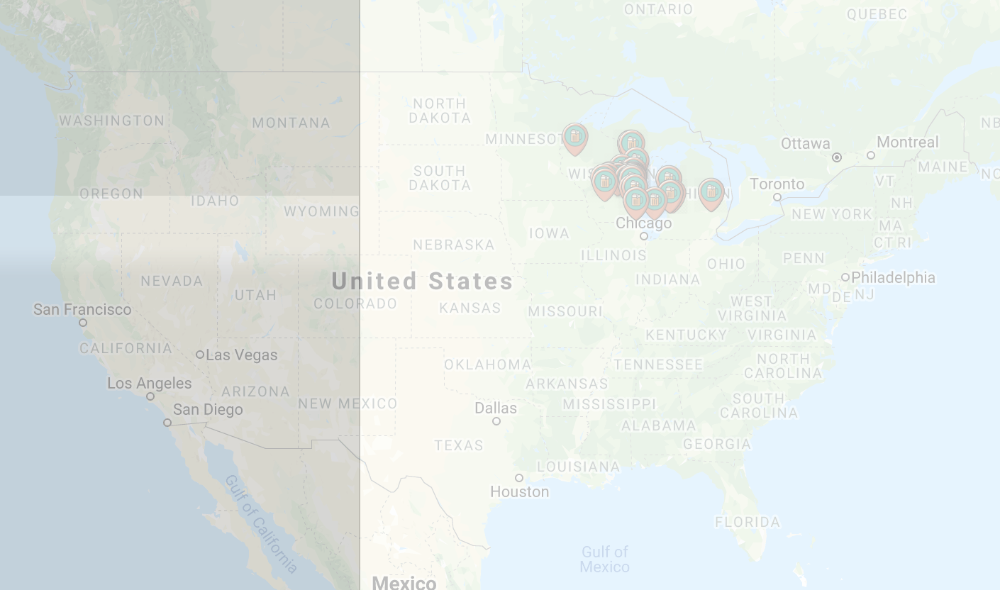

# Brewery Map

This simple HTML page reads in brewery names from a google sheet, looks them up using the google maps places library, and then maps them on a google map.

## API Key and Sheet ID

To run this as is you will need to populate your API_KEY and SHEET_ID.

```
var API_KEY = "API_KEY";
var SHEET_ID = "SHEET_ID";
```

## The Google Sheet

The Google sheet is formatted as below. The first column does not matter and is ignored. The second column is used to extract the states which are appended to the brewery name for searching. Every row after that is a unique brewery found in the state that is contained at the top of the column. Blank cells are fine and are also ignored.

You can adjust the columns/rows in the API call that is used to fetch the data if your sheet varries. 



## Site

Pretty basic site - the map will occupy 100% of the page. Below the map will be a list of all of the breweries that it mapped. When the map loads there is an overlay of a loading page that show progress as it loads all of the breweries. This can take some time as there are limits to how quickly you can call the google APIs. if you reach a limi the javascript will take a 10 second pause and then resume.

The map will look like the below.



Here is am image that show the loading overlay.

